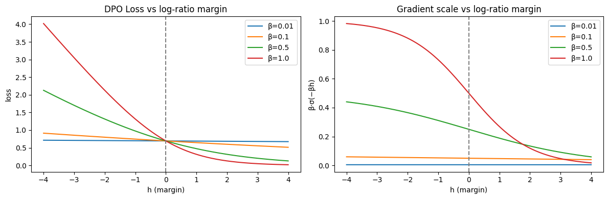
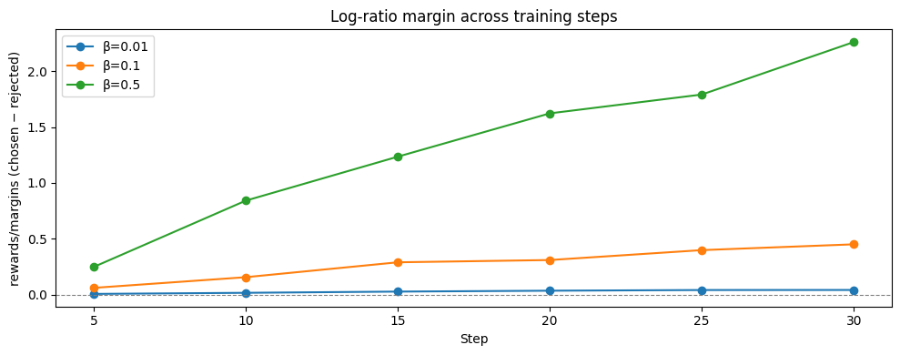

# Tweet Thread — What `beta=0.1` Is Actually Doing in Your DPO Trainer

---

**Tweet 1**
You set `beta=0.1` in your DPO trainer and moved on.

But what is that number mechanically doing to your gradient on every single step?

Not the abstract answer ("balances preference learning and KL to reference").
The actual math. 

---

**Tweet 2**
Beta comes from the RLHF objective DPO was built to replace:

```
max_π  E[r(x,y)]  −  β · KL(π ‖ π_ref)
```

It is the Lagrange multiplier on the KL constraint.
Large β → policy must stay close to reference.
Small β → policy goes wherever reward points.

DPO collapses this into a single loss — but beta survives.

---

**Tweet 3**
In the DPO gradient, beta plays two separate roles:

```
∂L/∂θ  ∝  −β · σ(−βh) · (∇log π_θ(y_w) − ∇log π_θ(y_l))
```

**Role 1 — step size:** the leading −β scales every update directly. Double beta, double the update.

**Role 2 — self-stopping signal:** β inside σ(−βh) controls how fast the gradient collapses once pairs are already well-separated.

At β=0.01, the sigmoid barely moves. The model keeps updating at near-full strength even on pairs it has already learned. No brake.



---

**Tweet 4**
There is a trap in TRL's training logs.

`rewards/margins` is not raw policy drift — it is **β × h** (beta baked in).

β=0.01 looks flat. β=0.5 looks aggressive. Divide by beta:

| β    | Reported margin | Actual drift (h) |
|------|----------------|-----------------|
| 0.01 | ~0.07          | **7.0**         |
| 0.1  | ~0.47          | 4.7             |
| 0.5  | ~2.23          | 4.5             |

β=0.01 drifted furthest from the reference. β=0.5 drifted least. The default metric hides this.



---

**Tweet 5**
This is the same mechanism behind reward model overoptimisation in full RLHF.

Without a strong KL penalty, a policy finds high-reward responses the reward model was never trained to evaluate — and scores break down.

In DPO there is no explicit reward model, but low beta lets the policy drift into regions the preference data never covered. Same failure mode, different surface.

If you are training on ~200 pairs with β=0.1: watch `rewards/margins / beta` in your logs. If it keeps climbing past your final step with no plateau, your model has not converged.

---

**Tweet 6**
Full explainer with the math, both plots, and the minimal TRL experiment to reproduce it:


Sources:
- Rafailov et al. 2023 — Direct Preference Optimization (NeurIPS 2023)
- Stiennon et al. 2020 — Learning to Summarize with Human Feedback
